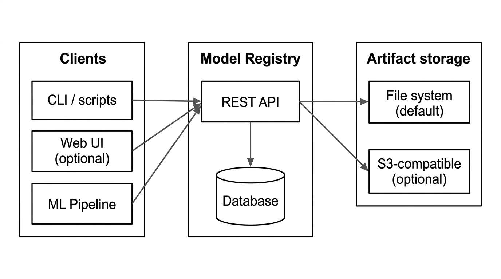
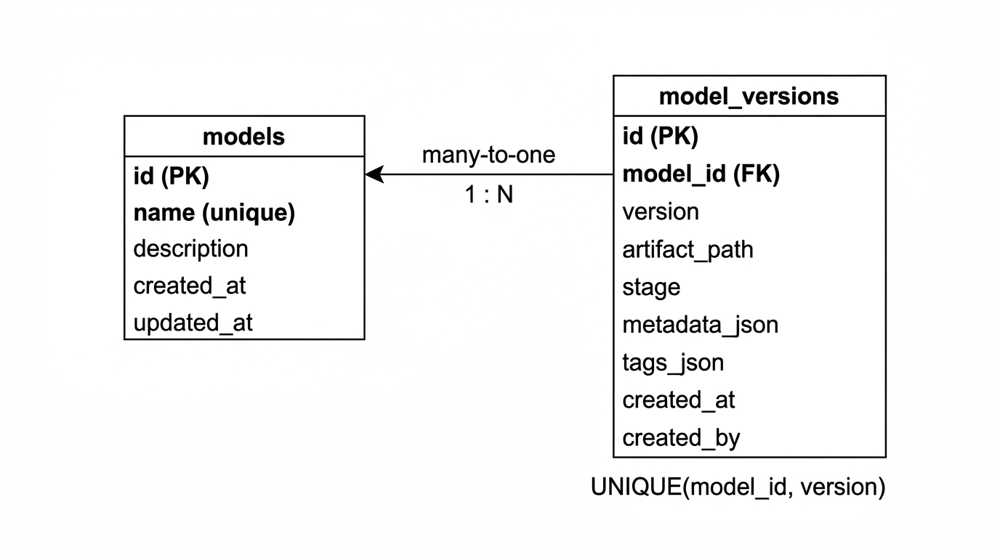

# Отчёт: ДЗ по Model Registry

## 1. Существующие проблемы

Текущее состояние — это «склад папок» без контекста и без единого контракта.

| Категория | Проблема |
| --- | --- |
| **Метаданные** | Нет информации о модели: автор, дата, датасет, метрики, фреймворк, конфиг обучения. Только имена папок. |
| **Версионирование** | Несогласованное именование (`v1`, `v_123`, `v1_v0_with_rank_dataset_0`) |
| **Обнаруживаемость** | Невозможно искать модели по назначению, тегу или метрикам; нет каталога |
| **Линейность (lineage)** | Не зафиксировано, какой датасет/конфиг использовался для какой версии |
| **Жизненный цикл** | Нет понятий dev/staging/production; непонятно, какую модель использовать в проде. |
| **Масштаб и надёжность** | Один сервер, одна директория — риск потери данных |
| **Доступ** | Нет контроля доступа и аудита: кто что зарегистрировал и скачал |

## 2. Требования

### 2.1 Функциональные

- **ФТ-1. Регистрация модели**: имя, (опционально) описание.
- **ФТ-2. Регистрация версии**: `model_name`, `version`, `artifact_path`/URI, `stage`, `metadata` (JSON), `tags`.
- **ФТ-3. Версионирование**: уникальная версия в рамках имени модели (уникальность \(model\_name + version\)).
- **ФТ-4. Поиск и фильтрация**: по имени, тегам, стадии, пагинация.
- **ФТ-5. Получение информации**: карточка модели + список версий; карточка конкретной версии.
- **ФТ-6. Жизненный цикл**: стадии `development` / `staging` / `production`, перевод версии между стадиями.
- **ФТ-7. (Опционально) Миграция**: сканирование текущей директории `models/` и регистрация найденных папок как версий с минимальными метаданными.

### 2.2 Нефункциональные

- **НФТ-1. Простота внедрения**: REST API;
- **НФТ-2. Масштабируемость метаданных**: тысячи моделей/версий, десятки команд (индексы, нормальная схема).
- **НФТ-3. Аудит**: фиксация создания версии (кто/когда) хотя бы на уровне `created_by`, `created_at`.
- **НФТ-4. Нейтральность**: метаданные в JSON, без привязки к конкретному ML-фреймворку.
- **НФТ-5. Безопасность путей**: артефактные пути не должны «убегать» из настроенного корня при использовании относительных путей.

## 3. Архитектура

```mermaid
flowchart LR
  subgraph clients [Клиенты]
    CLI[CLI / скрипты]
    Web[Web UI (опционально)]
    Pipeline[ML Pipeline]
  end

  subgraph registry [Model Registry]
    API[REST API]
    DB[(База данных)]
  end

  subgraph storage [Хранилище артефактов]
    FS[Файловая система (по умолчанию)]
    S3[S3-совместимое (будущее)]
  end

  CLI --> API
  Web --> API
  Pipeline --> API
  API --> DB
  API --> FS
  API --> S3
```



### Обоснование компонентов и технологий

- **REST API (FastAPI)**: единая точка входа; удобно ML-командам; OpenAPI/Swagger
- **БД (SQLite в MVP)**: хранит метаданные/версии; легко поднять локально. Дальше можно заменить на PostgreSQL
- **Хранилище артефактов (ФС)**: в первой итерации сохраняем путь/URI, не перемещая данные;

### Поток данных

- **Регистрация версии**: клиент → API (валидация + уникальность) → БД (метаданные) → клиент получает ссылку на артефакт.
- **Поиск**: клиент → API → запрос в БД → список моделей/версий.
- **Использование артефакта**: клиент получает путь/URI и читает артефакты напрямую из ФС (или через future proxy/S3).

## 4. API и схема БД

### 4.1 API (основные эндпоинты)

| Метод | Путь | Назначение |
| --- | --- | --- |
| POST | `/models` | Создать модель (имя, описание). |
| GET | `/models` | Список моделей с фильтрами: `name`, `tag`, `stage`, `limit`, `offset`. |
| GET | `/models/{name}` | Информация о модели и список версий. |
| POST | `/models/{name}/versions` | Зарегистрировать новую версию. |
| GET | `/models/{name}/versions/{version}` | Получить метаданные версии. |
| PATCH | `/models/{name}/versions/{version}` | Обновить `stage`/`metadata`/`tags`. |
| GET | `/models/{name}/versions/{version}/artifact` | Вернуть нормализованный путь к артефакту и флаг существования. |
| POST | `/scan` | (Опционально) Сканирование директории артефактов и регистрация найденных папок. |

### 4.2 Схема БД



**`models`**

- `id` (PK)
- `name` (unique, index)
- `description`
- `created_at`, `updated_at`

**`model_versions`**

- `id` (PK)
- `model_id` (FK → `models.id`, index)
- `version` (string)
- `artifact_path` (string)
- `stage` (string: `development|staging|production`, index)
- `metadata_json` (JSON)
- `tags_json` (JSON)
- `created_at` (index), `created_by`
- уникальность: `(model_id, version)`

### 4.3 Примеры запросов

Регистрация версии (логика уровня API/ORM):

- `INSERT INTO models (name, ...)` (если модели ещё нет)
- `INSERT INTO model_versions (model_id, version, artifact_path, stage, metadata_json, tags_json, created_by, created_at) ...`

Поиск моделей по стадии и тегу:

- фильтрация по `model_versions.stage = 'production'`
- фильтрация по `tags_json` (SQLite JSON): `json_extract(tags_json, '$.team') = 'mlds_1'`

## 5. Реализация

Код находится в директории `model-registry/`

- Запуск и примеры запросов: см. `model-registry/README.md`.
